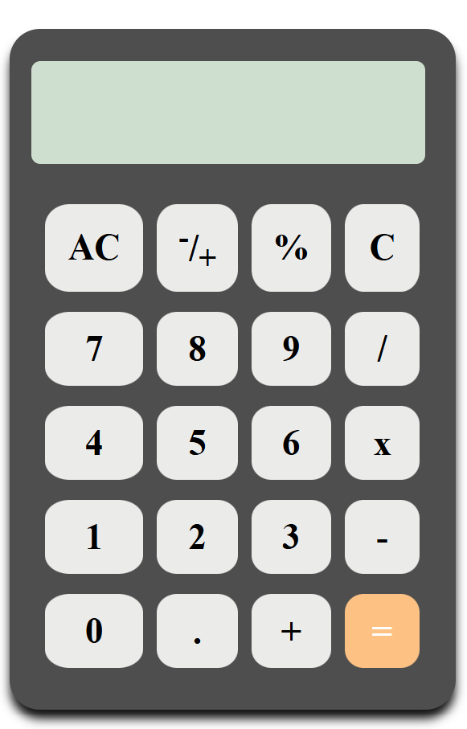

# Calculator Web App 🖩

A simple calculator built using **HTML, CSS, and JavaScript**.

---

## Features

- Addition, Subtraction, Multiplication, Division
- Power operation (`x^`)
- Clear (`AC`) and Delete (`C`) buttons
- Responsive layout

---

## Preview




---

## How to Use

1. Clone the repository:
```bash
git clone https://github.com/akashghosh666/calculator.git
